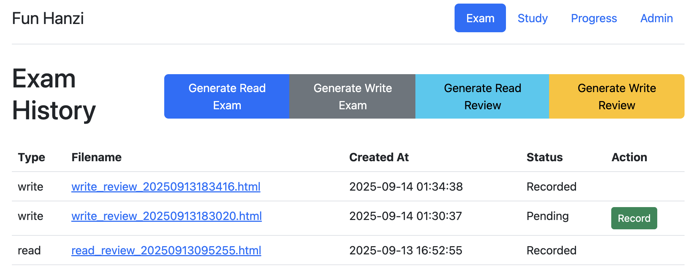
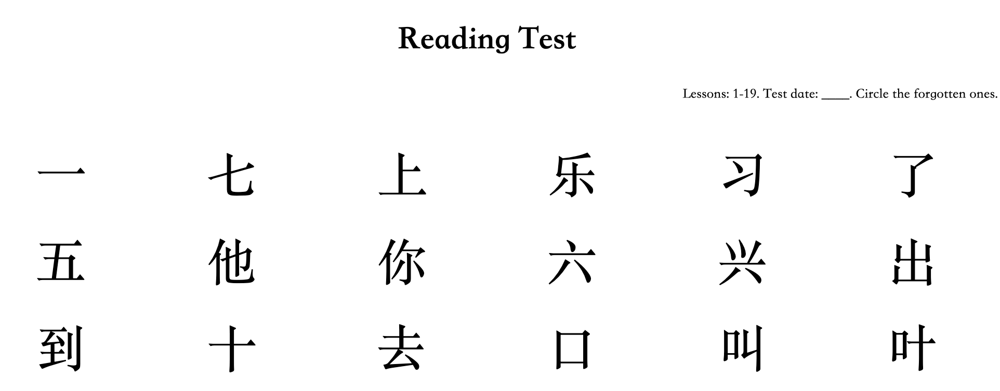
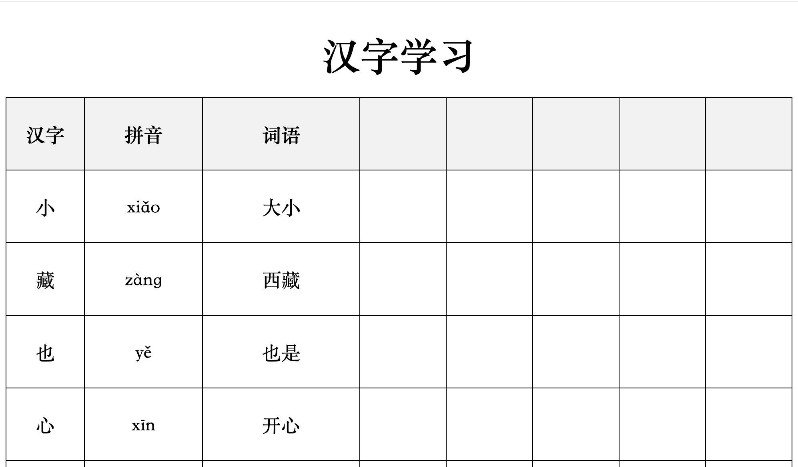
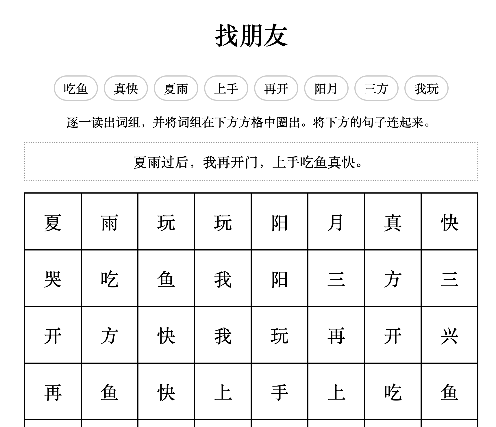
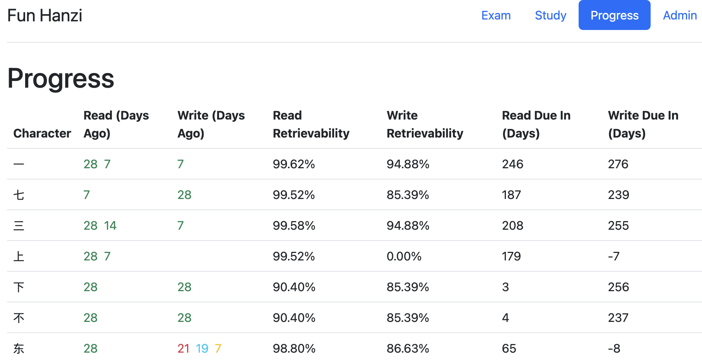

# Fun Hanzi Chinese Learning

## Overview

A tool designed to help users learn Chinese characters with fun. The application provides modules for generating exams, creating study materials. It uses of a Spaced Repetition System (SRS) to optimize the learning process.

## Features

The web application is organized into four main tabs: Exam, Study, Progress, and Admin.

### Exam Tab

This tab is focused on generating and reviewing practice exams.

*   **Exam History:** Displays a table of all previously generated exams.
    *   Each row shows the exam type (Read, Write, Read Review, Write Review), a link to the generated HTML file, the creation timestamp, and its status (Pending/Recorded).
*   **Generate Read/Write Exam:** Buttons that trigger the creation of new exams with a random selection of characters based on the parameters set in the Admin tab.
*   **Generate Read/Write Review Exam:** Buttons that generate new exams using only characters that are due for review, as determined by the FSRS scheduler.
*   **Record Exam Results:** A "Record" link for each pending exam leads to a page where the user can input a score (0-10) for each character. Submitting the form saves the scores to the database and triggers a rebuild of the FSRS cards to update the learning schedule.





### Study Tab

This tab provides tools for creating and reviewing study materials.

*   **Study History:** Displays a table of all previously generated study materials.
    *   Each row shows the study material type (Character Sheet/Word Puzzle), a link to the generated HTML file, the creation timestamp, and a status (Pending/Done).
*   **Mark as Done:** A button to mark a study session as complete.
*   **Generate Study Sheet:** A button that creates a new character study sheet, including pinyin and common words, using the Gemini API.
*   **Generate Find Words Puzzle:** A button that creates a "find the words" puzzle game.






### Progress Tab

This tab offers a consolidated, FSRS-driven view of the user's learning progress.

*   **Character Progress Table:** Displays a detailed table of all characters within the configured lesson range.
    *   **Character:** The Chinese character.
    *   **Read/Write (Days Ago):** Shows how many days have passed since the last review for each card type. The score is color-coded (red for poor, green for good) to provide a quick visual indicator of performance.
    *   **Read/Write Retrievability:** Displays the FSRS-calculated probability (as a percentage) that the user will successfully recall the character at this moment.
    *   **Read/Write Due In (Days):** Shows the number of days until the next scheduled FSRS review for each card.



### Admin Tab

This tab allows the user to configure the parameters for generating exams and study materials.

*   **Settings Form:** A form with the following fields:
    *   **Lesson Range:** A string to define which lessons to pull characters from (e.g., "1-10", "5,8,12-15"). This range determines which characters are loaded into the FSRS system.
    *   **Number of Characters (Read Exam):** An integer specifying how many characters to include in a reading exam.
    *   **Number of Characters (Write Exam):** An integer specifying how many characters to use as a basis for a writing exam.
    *   **Number of Characters (Study):** An integer specifying how many characters to include in study materials.
*   **Save Functionality:** A "Save" button to persist the settings to the database.

### Spaced Repetition

The application's learning schedule is managed by the `py-fsrs` library.

*   **Separate Schedulers:** Two distinct FSRS schedulers are used:
    *   A **Read Scheduler** with a desired retention rate of 90%.
    *   A **Write Scheduler** with a desired retention rate of 60%, reflecting the higher difficulty of writing characters from memory.
*   **Implied Reading Records:** To better model the learning process, the system assumes that writing proficiency implies reading proficiency. When a "write" score is recorded, an implied "read" record is also generated for the same character with a score bonus (+3, capped at 10).
*   **Card Rebuilding:** On application startup and after new exam scores are recorded, the entire history of review records is replayed to build the current state of all FSRS cards. This ensures the learning schedule is always accurate and up-to-date.

## Getting Started

Ensure a python environment is installed. [uv](https://docs.astral.sh/uv/getting-started/installation/) is recommended.

Set `GEMINI_API_KEY=xxx` in `~/.env`. Get a `free` Gemini API key from https://aistudio.google.com/apikey.

The characters you will study lives in `words.txt`. You can change the content, with one line per "lesson".

Then run the web server:

```
uv run webapp/app.py
```

Navigate to http://127.0.0.1:5000/.

## Technical Stack

*   **Backend Framework:** Flask
*   **Frontend Styling:** Bootstrap CSS
*   **Database:** SQLite
*   **Spaced Repetition:** `py-fsrs`
*   **AI Integration:** Gemini for study material generation.

## Future Enhancements

*   **More Fun Studies:** Create different kinds of fun study sheets.
